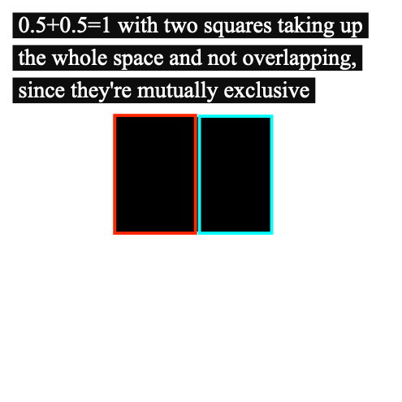

# Learning Bayes 

Just one of the things I'm learning. https://github.com/hchiam/learning

## A indep B ⇒ p(A & B) = p(A) \* p(B):

## A not indep B ⇒ p(A & B) = p(A if B) \* p(B):

## A xor B ⇒ p(A or B) = p(A) + p(B):

## A not xor B ⇒ p(A or B) = p(A) + p(B) - p(A: & B)

